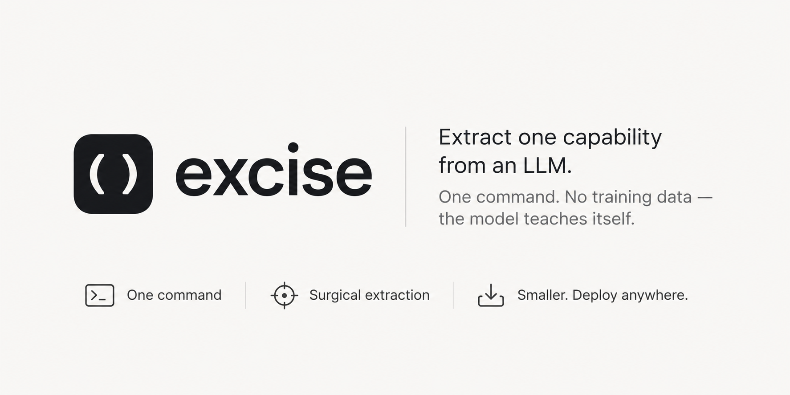
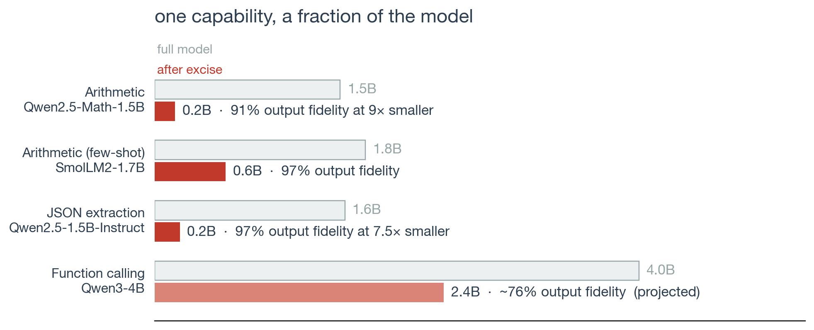
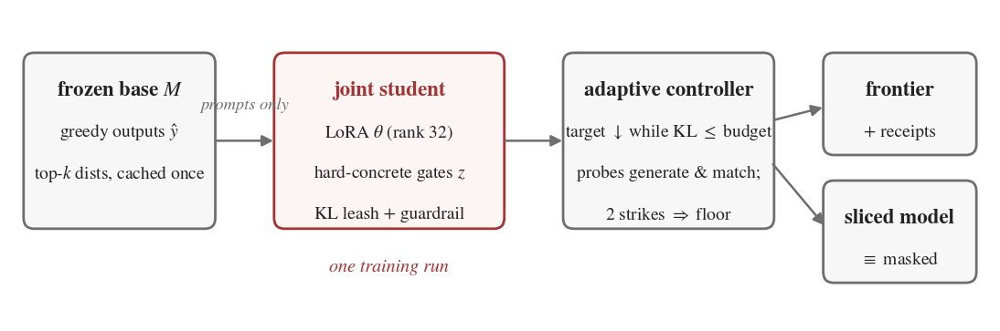
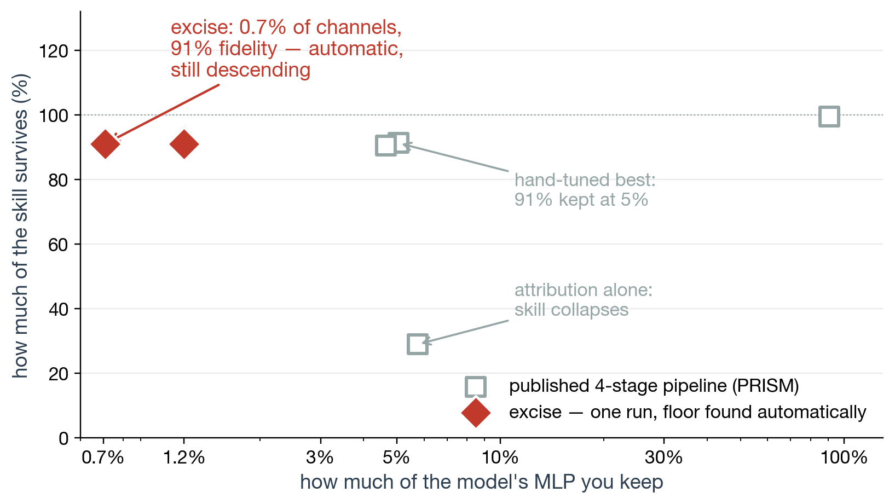

# excise

<p align="center"></p>

<p align="center">
<a href="LICENSE"></a>
<a href="pyproject.toml"></a>
</p>

```python
from excise import extract, load_sliced

result = extract("Qwen/Qwen2.5-Math-1.5B", prompts=my_prompts)  # just prompts
print(result.report())     # frontier, floor, integrity receipts
small = result.export_sliced(prune_vocabulary=True)  # 1.54B -> 0.17B here
result.save("substrate/")  # receipts + the sliced model
model = load_sliced("substrate/sliced")              # round-trips
```

<p align="center"></p>

## Why

You deploy a 4B model to do one thing — call your API, extract your fields,
do your arithmetic — and pay for everything else it knows. Most of a language
model is not needed for any single behavior. `excise` finds the part that
is, and lets you delete the rest.

## How it works, in three steps

<p align="center"></p>

1. **The model teaches itself.** You provide prompts that exercise the
   capability — no labels. The frozen model's own outputs become the target.
2. **Channels close while an adapter compacts the skill.** Learnable gates on
   every MLP channel train jointly with a small LoRA adapter that keeps
   behavior identical as the network shrinks around it. A controller closes
   channels exactly as fast as behavior allows — measured by *actually
   generating*, not by loss curves (losses lie at high sparsity; we measured
   a 35-point silent failure).
3. **Export.** The run stops at the floor it discovered, hands you the whole
   size-vs-fidelity curve, an integrity report, and — via
   `export_sliced()` — a physically smaller model with the dead weights
   deleted.

## Results

One 12-minute run on a $0.40/hr GPU vs. the published four-stage pipeline,
on that pipeline's own benchmark:

<p align="center"></p>

Measured results (single RTX 4090, details in the paper):

| Capability | Model (architecture) | Kept channels | Fidelity | Exported size |
|---|---|---|---|---|
| 2-digit arithmetic | Qwen2.5-Math-1.5B (Qwen2) | **1.2%** of MLP | 91% verbatim match | **1.54B → 0.17B (9.0×)** |
| Arithmetic, few-shot | SmolLM2-1.7B (Llama) | 7.4% of MLP | 97.2% verbatim match | 1.75B → 0.59B (3.0×) |
| JSON extraction | Qwen2.5-1.5B-Instruct (Qwen2) | 27.5% of MLP | 90.0% verbatim match | 1.58B → 0.49B (3.2×) |
| Function calling (BFCL) | Qwen3-4B (Qwen3) | 40% of MLP | ~76% verbatim match | 4.0B → ~2.4B projected |

The arithmetic row uses v0.2's recalibrated controller and vocabulary
pruning (the capability touches 1,746 of 151,936 token ids; the embedding
shrinks accordingly). On the research benchmark against PRISM's staged
pipeline, a single run still reaches 100.9% task-accuracy recovery at 5% of
channels — see the paper.

The JSON row is also the v0.2 validation story: under v0.1 its report
flagged catastrophic unmasked drift (55.8% self-match). The audit traced
the root cause to a biased sparse-KL cache that made the guardrail sharpen
the model it was meant to anchor, compounded by a guardrail-free polish
phase. v0.2 (binned KL + off-task anchor texts + guardrail through polish)
reruns the identical task: drift drops to 8 points (88.3% vs a 96.7% base
decode-noise ceiling) and the floor *improves* to 27.5%. The receipts
flagged it; the receipts now confirm the fix.

- **Label-free.** The target is the model's own unmasked output distribution.
  You provide prompts; nothing else.
- **The whole size-fidelity frontier from one run.** An adaptive controller
  closes channels as fast as behavior allows and stops at the floor itself.
- **Behavior probes, not loss curves.** Distribution-level KL reads healthy
  while generation quality collapses at high sparsity (we measured a 35-point
  silent failure). The controller decides by actually generating.
- **Receipts.** Every extraction reports a random-mask control, unmasked-model
  drift, and the full probe trace. If your task was trivially easy or the
  extraction is invalid, the report says so.
- **Real export.** `export_sliced()` deletes the dead weights. Slicing is
  mathematically equivalent to masking for gated MLPs — fidelity is identical
  to the masked evaluation (verified to one eval example in 810).

## Honest caveats

- **Memory shrinks unconditionally; speed depends on workload.** At this
  model scale, single-stream eager decoding is launch-overhead-bound: the
  0.17B export decodes at the same ~40 tok/s as the 1.54B original on an
  RTX 4090. The win is memory (9× fewer parameters), which buys batch,
  context, or a smaller device — latency gains need larger models, batched
  serving, or a compiled runtime.
- The extracted model is a specialist. Out-of-capability behavior degrades —
  that's the point — so route accordingly.
- Capabilities differ in how small they can go: narrow skills (arithmetic)
  compress to a few percent; broad ones (function calling) need a substantial
  fraction of channels.
- Sliced checkpoints have heterogeneous layer widths; `result.save()`
  writes them with `save_pretrained` and `excise.load_sliced(dir)` reloads
  them. (Never "fix" a width mismatch with `ignore_mismatched_sizes=True` —
  transformers silently reinitializes the mismatched weights.)
- Vocabulary-pruned models speak a remapped token-id space; the old→new map
  ships in the model config (`excise_vocab_keep`).

## Install

```bash
pip install excise          # PyPI release pending; for now:
pip install git+https://github.com/Aryagm/excise
```

## CLI

```bash
excise extract --model Qwen/Qwen2.5-Math-1.5B --prompts prompts.txt \
    --out substrate/ --slice
```

## How it works (short version)

Hard-concrete L0 gates on every MLP intermediate channel (warm-started from
grad×act attribution) train jointly with a rank-32 LoRA adapter under a
forward-KL leash to the frozen base model — a *binned* KL over the cached
top-k support plus its residual mass, which is zero exactly at agreement.
A Lagrangian controller lowers the open-channel target whenever the KL stays
under budget; behavior probes (teacher-forced, on a dev split the gradient
never sees, scored against the unmasked model measured at the same step)
veto the descent when behavior degrades, and the gates roll back to the
last passing sparsity. A guardrail term keeps the *unmasked* model anchored
to the base — rotating over off-task anchor text when provided — so the
adapter can't cheat by becoming a different model. After the floor is
found, a brief polish under the hardened binary mask (guardrail still
active) removes the stochastic-gate train/eval mismatch.

Builds on the capability-extraction framing of Mishra & Pagare's
[PRISM](https://github.com/e-xperiments/prism-capability-extraction) — the
extraction contract and recovery metric come from their work; credit to them
for posing the problem precisely. On their arithmetic benchmark, one
`excise` run matches or beats their staged pipeline's best hand-tuned result
at every budget.

## License

MIT
